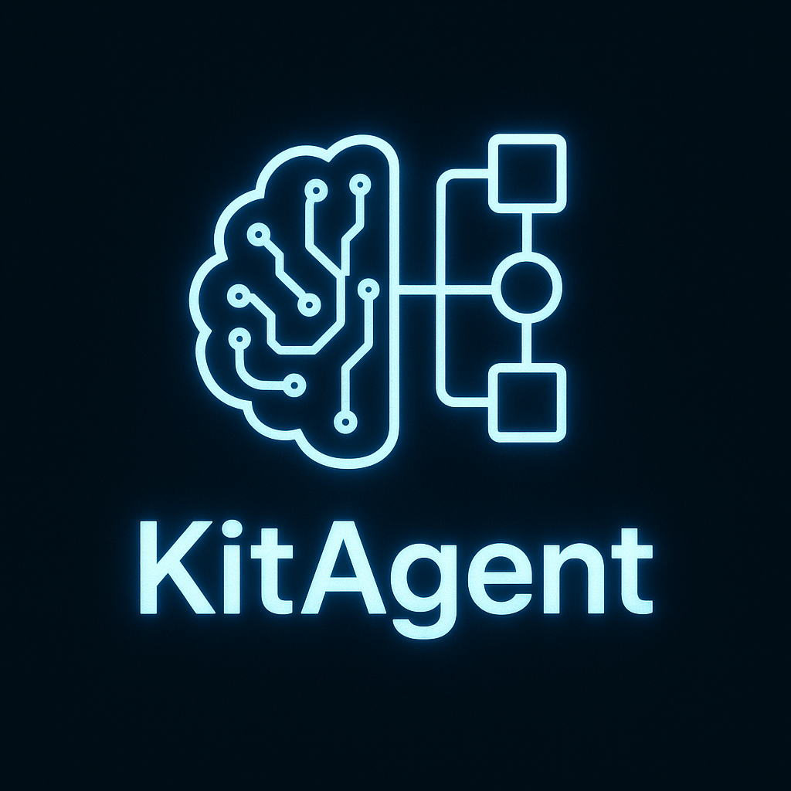

# KitAgent

KitAgent is a workflow-based API framework powered by YAML and AI agents. Create extensible tools, workflows, and intelligent agents with zero boilerplate.



## 🚀 Getting Started

The easiest way to get started with KitAgent is to use our template:

```bash
# Clone the template repository
git clone https://github.com/Drakezair/kitagent/tree/main/template my-kitagent-project

# Navigate to the project directory
cd my-kitagent-project

# Install dependencies
pnpm install

# Start development server
pnpm dev:watch
```

## 📝 Description

KitAgent is a modern backend framework designed to create AI-powered applications with minimal effort. It leverages YAML for configuration and provides a clean architecture for developing tools, workflows, and agents. KitAgent enables developers to focus on business logic rather than boilerplate code.

### ✨ Why Use KitAgent?

- 🧰 **Tools System**: Create reusable and composable tools with a simple API
- 🔄 **Workflow Engine**: Define complex workflows with YAML
- 🤖 **AI Agent Integration**: Seamlessly integrate AI models into your applications
- 📨 **HTTP Interface**: Expose your workflows and agents via HTTP endpoints
- 🧩 **Model Context Protocol**: Support for the Model Context Protocol (MCP) for better interoperability
- 🔌 **Extensible**: Easy to extend with custom functionality

### 🧠 Philosophy

KitAgent follows these core principles:

1. **Declarative over Imperative**: Use YAML to declare workflows instead of writing procedural code
2. **Convention over Configuration**: Follow simple patterns to get started quickly
3. **Modular Architecture**: Build applications with reusable components
4. **AI-First Approach**: Designed with AI integration in mind from the beginning
5. **Developer Experience**: Focus on making the framework easy to use and understand

## 🏗️ Architecture

KitAgent is built around several key components:

### Tools

A tool is a reusable function that performs a specific task. Tools can be composed together to create more complex functionality.

Example of a tool:

```typescript
// weatherTool.ts
import { z } from 'zod';
import { registerTool } from 'kitagent';

registerTool({
  name: 'weather',
  description: 'Get current weather for a location',
  parameters: {
    location: z.string().describe('The city and country')
  },
  execute: async ({ params }) => {
    // Implementation to fetch weather
    return { temperature: 22, conditions: 'Sunny' };
  }
});
```

### Workflows

Workflows define a sequence of steps that can include tools or agents. They are defined using YAML files.

Example of a workflow:

```yaml
# travel-planner.wf.yml
name: travel-planner
steps:
  - name: getWeather
    tool: weather
  - name: suggestActivities
    agent: activities
http:
  method: post
  path: /api/travel-planner
```

### Agents

Agents are AI-powered components that can use tools to accomplish tasks. They are defined similar to tools but with additional AI capabilities.

Example of an agent:

```typescript
// activitiesAgent.ts
import { z } from 'zod';
import { registerAgent } from 'kitagent';

registerAgent({
  name: 'activities',
  description: 'Suggests activities based on weather',
  parameters: {
    weather: z.object({
      temperature: z.number(),
      conditions: z.string()
    })
  },
  tools: ['googleMaps', 'tripAdvisor'],
  task: async ({ params, tools, context }) => {
    // Use AI to suggest activities based on weather
    return { activities: ['Visit the park', 'Go to a cafe'] };
  }
});
```

### Chat Interface

KitAgent provides a chat interface for interactive AI experiences.

Example of a chat configuration:

```yaml
# travel-assistant.chat.yml
name: travel-assistant
type: chat
client: openai
tools:
  - weather
  - activities
http:
  path: /api/chat/travel-assistant
```

### Model Context Protocol (MCP)

Support for the Model Context Protocol enables better integration with different AI models.

Example of an MCP configuration:

```typescript
// travelPlanner.mcp.ts
import { registerMCP } from 'kitagent';

registerMCP({
  name: 'travel-planner',
  description: 'A travel planning assistant',
  version: '1.0.0',
  path: '/api/mcp/travel-planner',
  tools: ['weather', 'activities'],
  server: async ({ server }) => {
    // Configure MCP server
  }
});
```

## 🔍 Use Cases

KitAgent is ideal for:

- 🤖 **AI-powered APIs**: Create endpoints that leverage AI models
- 🔄 **Workflow Automation**: Automate complex business processes
- 💬 **Chatbots and Assistants**: Build intelligent conversational agents
- 🧩 **API Orchestration**: Combine multiple APIs into cohesive workflows
- 🔍 **Data Processing Pipelines**: Process and transform data with AI augmentation

## 🛣️ Roadmap

- [ ] Create simple interface for integration with different AI models and chat providers
- [ ] Develop a visual UI for creating workflows, MCP, and chat systems with drag-and-drop functionality
- [ ] Build a CLI for scaffolding new KitAgent projects
- [ ] Add real-time capabilities with WebSocket support
- [ ] Implement database adapters for persistent storage
- [ ] Create a plugin system for extending functionality
- [ ] Add authentication and authorization mechanisms
- [ ] Develop comprehensive testing utilities
- [ ] Create deployment templates for various cloud providers

## 📚 Examples

Check out the [examples directory](./template) for complete samples of:

- Tools implementation
- Workflow definitions
- Agent configurations
- Chat setups
- MCP implementations

## 📄 License

KitAgent is open source software licensed under the [MIT license](LICENSE.md).

## 👥 Contributing

We welcome contributions! Please see our [Contributing Guide](CONTRIBUTING.md) for details on how to get started.

## 🙏 Acknowledgements

KitAgent is inspired by frameworks like Express, NestJS, and Langchain, aiming to combine the best aspects of these tools with a focus on AI integration.